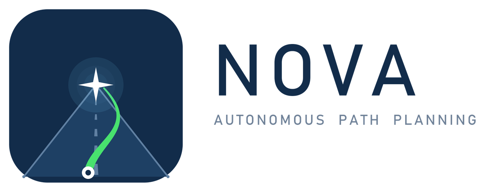

# NOVA

**Autonomous path navigation and collision avoidance for Indian road conditions.**

Smart India Hackathon 2026 · Problem Statement **26037** (MathWorks) · Team Diamonds



---

## The problem

The requirement is a vehicle that follows a mapped route and **decelerates or halts before an
imminent impact**, rather than reacting after contact.

Existing autonomy stacks assume conditions these roads do not provide. They depend on visible
lane markings, on centimetre-accurate HD maps, and on class vocabularies drawn from Western
datasets — which contain no auto-rickshaw and merge riders into the pedestrian class.

The resulting failure is not a missed detection. **A detector without an auto-rickshaw class
assigns the nearest class it holds.** The planner then inherits that class's footprint, speed
envelope and manoeuvre distribution, and computes an avoidance around a vehicle whose dynamics
do not exist on the road. Two-wheelers and riders outnumber cars in this traffic, so the error
is systematic rather than occasional.

---

## Architecture

One rule governs the design: **every stage is typed by the _shape_ of its input, never by its
source.**

```
camera  ─┐
         ├─→ List[Track] ─→ Prediction ─→ Risk field ─→ Planner ─→ Control
simulator┘                                grid[t,y,x]   Hybrid A*   + safety
```

`nova/carla_bridge.py` is the only module permitted to `import carla`. Both it and
`nova/perception.py` emit `List[Track]`, so nothing downstream can tell which produced it.
That is why the same planner runs against simulator ground truth and against real dashcam
footage with no modification.

| Module | Role |
|---|---|
| `nova/types.py` | The data contract. Four types; everything else is written against them |
| `nova/perception.py` | Detection + tracking + monocular range → `List[Track]` |
| `nova/prediction.py` | Several weighted futures per agent, from per-class behavioural priors |
| `nova/riskmap.py` | Risk field indexed by **time as well as space** — `grid[t, y, x]` |
| `nova/planner.py` | Time-aware Hybrid A* over steering × acceleration primitives |
| `nova/route.py` | Global route by A* over the road graph |
| `nova/control.py` | Stanley cross-track controller |
| `nova/safety.py` | Time-to-collision governor and deadlock recovery |
| `nova/carla_bridge.py` | The simulator adapter — the only file that knows CARLA exists |
| `nova/hud.py`, `nova/minimap.py` | Live dashboard |

The risk field covers **−10 m to +50 m ahead and ±20 m laterally** at 0.25 m resolution, over a
3 s horizon in 0.25 s steps: 460,800 cells, rebuilt every planning tick.

---

## Results

**Closed loop in CARLA** — four independent seeds, 45 s each, Town01 with aggressive traffic:

| Seed | Route covered | At-fault collisions | Rear-ended |
|---|---|---|---|
| 1 | 29.2 % | **0** | 0 |
| 3 | 44.0 % | **0** | 0 |
| 11 | 19.1 % | **0** | 0 |
| 23 | 39.7 % | **0** | 0 |

19–23 km/h · zero unplanned route departures · worst-case clearance **6.22 m**, measured
against every predicted future at matching times.

Rear-end impacts are recorded separately from at-fault ones: a vehicle approaching from behind
is outside the authority of any actuator the system has, so counting it would measure the other
driver rather than the planner.

**Latency** — the requirement was 10 Hz:

| Stage | Time |
|---|---|
| Detector inference | 1.9 ms |
| Prediction | 0.5 – 0.7 ms |
| Risk map | 4 – 6 ms |
| Planner | 53 – 69 ms |
| **End to end** | **58 – 76 ms → 13–17 Hz** |

**Detector**, on IDD's official validation split (2,000 images, 32,542 instances):

| Class | AP50 | | Class | AP50 |
|---|---|---|---|---|
| **autorickshaw** | **0.600** | | person | 0.375 |
| bus | 0.590 | | bicycle | 0.236 |
| car | 0.582 | | animal | 0.141 |
| motorcycle | 0.561 | | vehicle fallback | 0.031 |
| truck | 0.503 | | | |
| rider | 0.467 | | **overall mAP50** | **0.409** |

**Auto-rickshaw is the strongest class in the model, ahead of car** — a class that exists in no
Western dataset.

Reported honestly: `vehicle fallback` is IDD's catch-all for unnameable vehicles and has no
consistent appearance to learn; excluding it, mAP50 is **0.451**. `bicycle` and `animal` are
weak because they carry only 938 and 1,510 training boxes — predicted from the box counts
before training and confirmed after.

---

## Running it

```powershell
python -m venv .venv ; .venv\Scripts\activate
pip install ultralytics opencv-python numpy networkx
```

**Module tests — no simulator or GPU needed.** Reproduces the latency and clearance figures:

```powershell
python test_modules.py
```

**Closed-loop in CARLA** (requires CARLA 0.9.16 at `C:\CARLA_0.9.16`):

```powershell
.\run_demo.ps1 -Seed 3
```

**On real dashcam video**, using the IDD-trained detector:

```powershell
.\day.ps1          # daytime clip
.\night.ps1        # night clip
```

Both wrap `scripts/nova_video.py`. Per-clip camera geometry matters: `--fov` and `--horizon`
set the focal length and the horizon row, and range is `fy · h / (v − cy)`, so the horizon row
scales every distance.

**Re-training the detector:**

```powershell
python scripts\idd_to_yolo.py --src <IDD_Detection> --dst idd_yolo
python scripts\train_idd.py
```

---

## What this does not claim

- **The video demo is open loop.** The footage is fixed, so the system draws the path it *would*
  take. Closed-loop driving is the CARLA demo.
- **Range on video is estimated, not measured.** It comes from where a bounding box meets the
  road plane. Good for ranking hazards, poor at absolute distance beyond ~30 m.
- **CARLA has no auto-rickshaw asset.** The closed loop exercises six of the nine classes. The
  class vocabulary is evidenced on real footage instead.
- **Prediction is heuristic, not learned.** There is no trajectory dataset for this traffic. An
  `LSTMPredictor` slot exists behind the same interface, and carries no trained weights.

---

## Data and licence

Trained on the [Indian Driving Dataset](https://idd.insaan.iiit.ac.in/) (IIIT Hyderabad), used
under its own terms and not redistributed here. `scripts/idd_to_yolo.py` regenerates the YOLO
form from the original download.

`best.pt` is our fine-tune and is included. The stock COCO checkpoint is fetched by Ultralytics
on first use.
